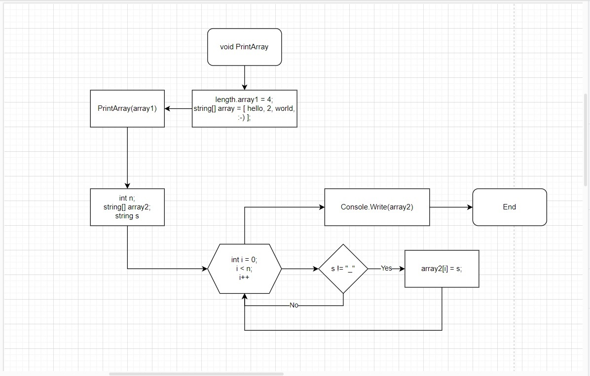

# Итоговая контрольная работа

## Задачи:
- Создать репозиторий на GitHub;
- Нарисовать блок-схему алгоритма;
- Снабдить репозиторий оформленным текстовым описанием (READ.ME);
- Написать программу, решающую поставленную задачу;
- Использовать контроль версий в работе над этим небольшим проектом (не должно быть так, что все залито одним коммитом, как минимум этапы 2, 3 и 4 должны быть расположены в разных коммитах);
---
*Основная Задача:*
__Написать программу, которая из имеющегося масива строк формирует массив строк, длина которых меньше либо равно 3 символа. Первоначальный массив можно ввести с клавиатуры, либо задать на старте выполнения алгоритма. При решении рекомендуется пользоваться коллекциями, лучше обойтись исключительно массивами.__

---
### Блок-схема

